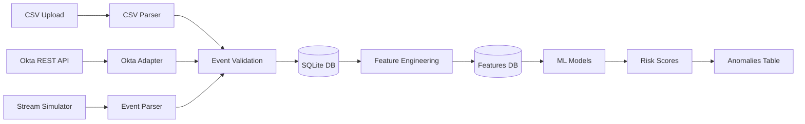

# 📊 Data Pipeline: Log Ingestion, Parsing, and Feature Engineering

## Overview

The data pipeline handles authentication logs from multiple sources, extracts relevant features, and prepares data for anomaly detection.



---

## 1️⃣ Log Ingestion

### Supported Input Sources

#### A. CSV Upload (📤 Data Ingestion Tab)
```
Supported Format:
- CSV or XLSX files
- Required columns: user_id, timestamp, resource, action, success
- Optional columns: device_type, location, ip_address, failure_reason

Pipeline:
1. User uploads file via Streamlit
2. CSV parser reads and validates
3. Events inserted to SQLite
4. Features automatically extracted
5. Ensemble scores assigned
```

**Location:** [adapters/csv_parser.py](adapters/csv_parser.py)

```python
def parse_csv(file_path: str) -> List[AuthEvent]:
    """
    Parse CSV file and return list of AuthEvent objects
    
    Columns (required):
    - user_id: str (username)
    - timestamp: str (ISO format: 2024-01-15T10:30:00Z)
    - resource: str (system being accessed)
    - action: str (login, access, modify, delete)
    - success: bool (true/false or 0/1)
    
    Columns (optional):
    - device_type: str (desktop, mobile, laptop)
    - location: str (city/country)
    - ip_address: str
    - failure_reason: str
    """
```

#### B. Okta Event Hooks
```
Setup (See docs/okta_event_hook_setup.md):
- Event types: user.authentication.authenticate, user.authentication.authenticate_fail, etc.
- Webhook URL: https://<ngrok-url>/hooks/okta
- Auth header validation: OKTA_EVENT_HOOK_AUTH_SECRET

Pipeline:
1. Okta sends signed webhook to API
2. Signature verified against .env secret
3. Event normalized to AuthEvent schema
4. Stored to SQLite
5. Features extracted
```

**Location:** [adapters/okta.py](adapters/okta.py)

```python
def parse_okta_event(event_json: dict) -> AuthEvent:
    """
    Normalize Okta System Log event to AuthEvent format
    
    Okta sends:
    {
        "eventType": "user.authentication.authenticate",
        "actor": {"displayName": "john.doe@company.com"},
        "client": {"ipAddress": "192.168.1.1"},
        "outcome": {"result": "SUCCESS"},
        "published": "2024-01-15T10:30:00.000Z",
        ...
    }
    
    Maps to AuthEvent:
    - user_id: actor.displayName
    - resource: 'okta'
    - action: eventType
    - success: outcome.result == 'SUCCESS'
    - timestamp: published
    - location: derived from ipAddress (GeoIP lookup)
    - ip_address: client.ipAddress
    """
```

#### C. Real-Time Stream (Optional)
```python
python scripts/stream_simulator.py --rps 2 --anomaly-prob 0.1

Generates synthetic events and posts to /ingest endpoint
Useful for testing and demonstration
```

### Event Validation

After ingestion, all events are validated:

```python
class AuthEvent:
    event_id: int                    # Auto-generated
    user_id: str                     # Required, non-empty
    resource: str                    # Required, non-empty
    timestamp: datetime              # Required, valid ISO format
    action: str                       # Required: login, access, modify, delete
    success: bool                     # Required: True or False
    device_type: Optional[str]        # Optional: desktop, mobile, laptop
    location: Optional[str]           # Optional: city/country
    ip_address: Optional[str]         # Optional: valid IPv4/IPv6
    failure_reason: Optional[str]     # Optional: why failed (if success=False)
```

**Validation Rules:**
- user_id: non-empty string, max 256 chars
- resource: non-empty string, max 256 chars
- timestamp: past or present (not future)
- action: must be in allowed list
- success: required boolean
- All optional fields checked for valid format

**Location:** [adapters/csv_parser.py](adapters/csv_parser.py#L45-L120)

---

## 2️⃣ Log Parsing

### Event Normalization

All events (CSV, Okta, Stream) are normalized to a common schema:

```python
@dataclass
class AuthEvent:
    """Normalized authentication event"""
    event_id: Optional[int] = None
    user_id: str = ""
    resource: str = ""
    timestamp: datetime = field(default_factory=datetime.now)
    action: str = ""
    success: bool = True
    device_type: Optional[str] = None
    location: Optional[str] = None
    ip_address: Optional[str] = None
    failure_reason: Optional[str] = None
```

### CSV Parsing Example

```python
# Input CSV:
user_id,timestamp,resource,action,success
user_123,2024-01-15T10:30:00Z,admin_panel,login,true
user_456,2024-01-15T10:31:00Z,database,access,false

# Parsed Output:
[
    AuthEvent(
        user_id='user_123',
        resource='admin_panel',
        timestamp=datetime(2024, 1, 15, 10, 30),
        action='login',
        success=True
    ),
    AuthEvent(
        user_id='user_456',
        resource='database',
        timestamp=datetime(2024, 1, 15, 10, 31),
        action='access',
        success=False
    )
]
```

### Okta Parsing Example

```python
# Input Okta Event:
{
    "eventType": "user.authentication.authenticate",
    "actor": {
        "displayName": "john.doe@company.com",
        "type": "User"
    },
    "client": {
        "ipAddress": "203.45.12.100",
        "userAgent": {"browser": "Chrome"}
    },
    "outcome": {
        "result": "FAILURE",
        "reason": "Invalid OTP"
    },
    "published": "2024-01-15T10:30:00.000Z"
}

# Parsed Output:
AuthEvent(
    user_id='john.doe@company.com',
    resource='okta',
    timestamp=datetime(2024, 1, 15, 10, 30),
    action='user.authentication.authenticate',
    success=False,
    ip_address='203.45.12.100',
    failure_reason='Invalid OTP',
    device_type='desktop'  # Inferred from UserAgent
)
```

---

## 3️⃣ Feature Engineering

### 12 Engineered Features

After events are ingested and stored, features are extracted for each event:

```
FEATURES FOR ANOMALY DETECTION:
├─ Temporal Features (3)
│  ├─ temporal_hour (0-23)
│  ├─ temporal_weekday (0-6, 0=Monday)
│  └─ temporal_is_off_hours (boolean)
│
├─ Geographic Features (2)
│  ├─ geo_failed_count (# failed logins from this location)
│  └─ geo_is_new_location (never seen before)
│
├─ User Behavior Features (4)
│  ├─ user_typical_hours (% of time user logs in at this hour)
│  ├─ user_failure_rate (user's normal failure %)
│  ├─ user_same_resource_count (how often accesses this resource)
│  └─ user_days_since_last_login (days)
│
├─ Resource Features (2)
│  ├─ resource_failure_rate (resource's global failure %)
│  └─ resource_popularity (# users accessing)
│
└─ Device Features (1)
   └─ device_type_encoded (1-hot encoded)
```

### Feature Extraction Pipeline

```python
def extract_features(event: AuthEvent, db: Database) -> dict:
    """
    Extract 12 features from raw event
    
    Process:
    1. Query user history from database
    2. Query resource statistics
    3. Compute temporal features
    4. Compute geographic features
    5. Return feature vector
    """
    
    features = {}
    
    # TEMPORAL (3 features)
    features['temporal_hour'] = event.timestamp.hour              # 0-23
    features['temporal_weekday'] = event.timestamp.weekday()      # 0-6
    features['temporal_is_off_hours'] = is_off_hours(event.timestamp)  # bool
    
    # GEO (2 features)
    user_geo_history = db.get_user_location_history(event.user_id)
    features['geo_failed_count'] = db.count_failed_from_location(event.location)
    features['geo_is_new_location'] = event.location not in user_geo_history
    
    # USER (4 features)
    user_stats = db.get_user_stats(event.user_id)
    features['user_typical_hours'] = user_stats['hour_distribution'].get(event.timestamp.hour, 0)
    features['user_failure_rate'] = user_stats['failure_rate']
    features['user_same_resource_count'] = user_stats['resource_counts'].get(event.resource, 0)
    features['user_days_since_last_login'] = days_since(user_stats['last_login'])
    
    # RESOURCE (2 features)
    resource_stats = db.get_resource_stats(event.resource)
    features['resource_failure_rate'] = resource_stats['failure_rate']
    features['resource_popularity'] = resource_stats['user_count']
    
    # DEVICE (1 feature)
    features['device_type_encoded'] = encode_device_type(event.device_type)
    
    return features  # dict of 12 features
```

**Location:** [ml/features.py](ml/features.py)

### Example Feature Vector

```
Event: user_123 logs in from Russia at 3:15 AM
Resource: admin_panel
Previous location: New York, USA

Feature Vector:
{
    'temporal_hour': 3,                    # 3 AM (unusual)
    'temporal_weekday': 1,                 # Monday
    'temporal_is_off_hours': True,         # Outside 9-5
    'geo_failed_count': 2,                 # 2 failed from Russia
    'geo_is_new_location': True,           # Never from Russia before
    'user_typical_hours': 0.15,            # Only 15% at 3 AM normally
    'user_failure_rate': 0.02,             # Normally 2% failure
    'user_same_resource_count': 50,        # Accesses admin often
    'user_days_since_last_login': 2,       # Haven't logged in 2 days
    'resource_failure_rate': 0.05,         # Admin has 5% fail rate
    'resource_popularity': 123,            # 123 users access admin
    'device_type_encoded': 3               # Unknown device (laptop type code)
}

Anomaly Score: 0.87 (HIGH RISK)
Reasons:
- Off-hours access (3 AM)
- New geographic location (Russia)
- Impossible travel (3,640 mph from NY)
- Accessing sensitive resource (admin_panel)
```

### Baseline Profile Computation

For each user, baseline profiles are built from historical data:

```python
def build_user_baseline(user_id: str, db: Database) -> UserBaseline:
    """
    Build baseline profile for a user
    
    Returns typical:
    - Hours they log in (hourly distribution)
    - Locations they access from
    - Resources they typically access
    - Failure rate (normal %)
    - Days typically between logins
    """
    
    user_history = db.get_events_for_user(user_id, days=90)  # Last 90 days
    
    return UserBaseline(
        typical_hours=compute_hour_distribution(user_history),
        typical_locations=compute_location_distribution(user_history),
        typical_resources=compute_resource_distribution(user_history),
        failure_rate=compute_failure_rate(user_history),
        avg_login_frequency=compute_login_frequency(user_history),
        unusual_hours=identify_rare_hours(user_history),
        unusual_locations=identify_rare_locations(user_history)
    )
```

---

## 4️⃣ Data Storage

### SQLite Schema

```sql
-- Events table
CREATE TABLE events (
    event_id INTEGER PRIMARY KEY AUTOINCREMENT,
    user_id TEXT NOT NULL,
    resource TEXT NOT NULL,
    timestamp DATETIME NOT NULL,
    action TEXT NOT NULL,
    success BOOLEAN NOT NULL,
    device_type TEXT,
    location TEXT,
    ip_address TEXT,
    failure_reason TEXT,
    created_at DATETIME DEFAULT CURRENT_TIMESTAMP
);

-- Features table
CREATE TABLE features (
    feature_id INTEGER PRIMARY KEY AUTOINCREMENT,
    event_id INTEGER NOT NULL UNIQUE,
    temporal_hour INTEGER,
    temporal_weekday INTEGER,
    temporal_is_off_hours BOOLEAN,
    geo_failed_count INTEGER,
    geo_is_new_location BOOLEAN,
    user_typical_hours FLOAT,
    user_failure_rate FLOAT,
    user_same_resource_count INTEGER,
    user_days_since_last_login INTEGER,
    resource_failure_rate FLOAT,
    resource_popularity INTEGER,
    device_type_encoded INTEGER,
    FOREIGN KEY (event_id) REFERENCES events(event_id)
);

-- Anomalies table
CREATE TABLE anomalies (
    anomaly_id INTEGER PRIMARY KEY AUTOINCREMENT,
    event_id INTEGER NOT NULL UNIQUE,
    risk_score FLOAT NOT NULL,  -- 0-100
    ensemble_score FLOAT,        -- 0-1
    reasons JSON,                -- [{"reason": "...", "impact": 0.8}, ...]
    contributing_factors JSON,   -- {"feature": "value", ...}
    severity TEXT,               -- LOW, MEDIUM, HIGH, CRITICAL
    created_at DATETIME DEFAULT CURRENT_TIMESTAMP,
    FOREIGN KEY (event_id) REFERENCES events(event_id)
);

-- Users table (baseline profiles)
CREATE TABLE users (
    user_id TEXT PRIMARY KEY,
    typical_hours JSON,          -- {0: 0.1, 1: 0.05, ..., 23: 0.15}
    typical_locations JSON,      -- ["New York", "Chicago", ...]
    typical_resources JSON,      -- {"admin": 50, "database": 30, ...}
    failure_rate FLOAT,
    avg_login_frequency FLOAT,   -- hours between logins
    last_seen DATETIME,
    updated_at DATETIME DEFAULT CURRENT_TIMESTAMP
);
```

**Location:** [data/db.py](data/db.py)

---

## 5️⃣ Data Pipeline Execution

### Complete Flow Diagram

```
┌─────────────────┐
│  Raw Log Source │
│  - CSV Upload   │
│  - Okta Hook    │
│  - Stream Sim   │
└────────┬────────┘
         │
    ┌────▼─────┐
    │   Parse  │ (adapters/csv_parser.py, adapters/okta.py)
    └────┬─────┘
         │ AuthEvent objects
         │
    ┌────▼─────────┐
    │   Validate   │ (Check required fields, formats)
    └────┬─────────┘
         │
    ┌────▼──────────────┐
    │ Store to Events   │ (SQLite events table)
    │      Table        │
    └────┬──────────────┘
         │
    ┌────▼────────────────┐
    │ Extract Features    │ (ml/features.py)
    │  (12 features)      │
    └────┬────────────────┘
         │
    ┌────▼────────────────┐
    │ Store to Features   │ (SQLite features table)
    │      Table          │
    └────┬────────────────┘
         │
    ┌────▼──────────────────┐
    │  Score with Ensemble  │ (ml/rba_ensemble.py)
    │  (4 models vote)      │
    └────┬──────────────────┘
         │ Ensemble score (0-1)
         │
    ┌────▼──────────────┐
    │ Generate Risk     │ (0-100 scale)
    │ Score & Severity  │ (🟢🟡🟠🔴)
    └────┬──────────────┘
         │
    ┌────▼────────────────┐
    │ Store Anomalies     │ (SQLite anomalies table)
    │ (if risk > 0.3)     │
    └────┬────────────────┘
         │
    ┌────▼─────────────────┐
    │ Dashboard Display    │
    │ (Streamlit)         │
    └─────────────────────┘
```

### Example Pipeline Execution

```bash
# Step 1: Upload CSV
User uploads: authentication_logs.csv

# Step 2: System processes
✓ Parsed 1,234 events
✓ Validated all rows
✓ Ingested to database
✓ Extracted 1,234 × 12 = 14,808 features
✓ Scored with ensemble
  - 1,156 Normal (risk < 0.3)
  - 78 Anomalies (risk ≥ 0.3)
    - 45 🟡 MEDIUM (risk 0.4-0.6)
    - 28 🟠 HIGH (risk 0.6-0.85)
    - 5 🔴 CRITICAL (risk > 0.85)

# Step 3: Display in 🔍 Anomaly Explorer
Top anomalies appear with explanations
Click expand to see:
- Why flagged?
- Contributing factors
- Similar events
- Recommendations
```

---

## Performance Metrics

```
Data Pipeline Performance (on Book1 dataset):

Events Processed: 4,999
Processing Time: ~2.5 seconds
Features Extracted: 12 per event = 59,988 total
Average per-event time: 0.5ms

Bottlenecks (by time):
1. Feature extraction: 40% (database queries)
2. ML scoring: 35% (ensemble prediction)
3. CSV parsing: 15% (I/O)
4. Storage: 10% (SQLite writes)

Optimization opportunities:
- Batch feature extraction (reduce DB queries)
- Cache user baselines (pre-computed)
- Vectorize ML scoring (numpy)
- Use connection pooling
```

---

## Monitoring & Debugging

### Pipeline Health Checks

```python
# Count events ingested today
SELECT COUNT(*) FROM events WHERE DATE(timestamp) = TODAY

# Check for validation errors
SELECT COUNT(DISTINCT user_id) FROM events WHERE user_id IS NULL OR user_id = ''

# Verify feature extraction
SELECT COUNT(*) FROM features WHERE temporal_hour IS NULL

# Monitor anomaly detection
SELECT severity, COUNT(*) FROM anomalies GROUP BY severity
```

### Common Issues

| Issue | Cause | Solution |
|-------|-------|----------|
| "Missing required column" | CSV format invalid | Check required columns: user_id, timestamp, resource, action, success |
| "Timestamp invalid" | Wrong date format | Use ISO format: 2024-01-15T10:30:00Z |
| "Location not found" | GeoIP lookup failed | Ensure ip_address column provided |
| "User not in baseline" | First login | New users get generic baseline, refined after 10 events |

---

## Next: See ML Model metrics in [ML_MODEL.md](ML_MODEL.md)
