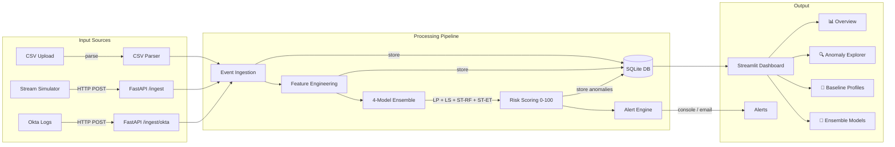
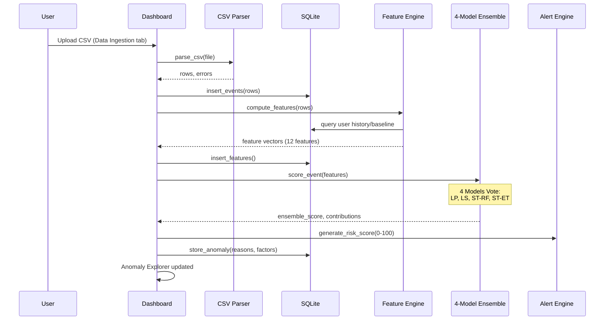

# Architecture

## System Overview



## Data Flow - Pre-Trained Ensemble



## Components

| Component | Tech | Role |
|-----------|------|------|
| API | FastAPI + Uvicorn | REST endpoints for ingestion, scoring, queries |
| Dashboard | Streamlit (6 tabs) | Web UI — 4-model ensemble, baselines, explanations |
| ML Ensemble | scikit-learn semi-supervised | 4 models voting: LP, LS, ST-RF, ST-ET |
| Feature Engine | Python + SQLite queries | 12 features: temporal, geo, behavioral |
| Storage | SQLite | Events, features, anomalies (with reasons), users |
| Risk Scoring | Python custom | Weighted ensemble + 0-100 scale + severity levels |
| Adapters | CSV parser, Okta normalizer | Multi-format log ingestion |

## 🤖 ML Models - 4-Model Ensemble

### Performance

| Metric | Score |
|--------|-------|
| **ROC-AUC** | **0.8884** ⭐ Excellent |
| **F1-Score** | 0.4091 |
| **Recall** | 0.4286 (catches ~43% anomalies) |
| **Accuracy** | 89.60% |
| **Test Set** | 1,000 events from Book1 |

### Models

1. **Label Propagation (LP)** - Semi-supervised, leverages unlabeled data
2. **Label Spreading (LS)** - Similar to LP, smoother transitions
3. **Self-Training Random Forest (ST-RF)** - Iterative pseudo-labeling
4. **Self-Training Extra Trees (ST-ET)** - Balanced, reduces overfitting

### Voting Schema

```
Ensemble Risk Score = (LP_score + LS_score + ST-RF_score + ST-ET_score) / 4
Risk Level = map(ensemble_score) to 🟢🟡🟠🔴
Reasons = union(all_model_explanations)
Contributing Factors = mean(feature_importance_across_models)
```

### Training Dataset

**Book1.xlsx Dataset:**
- 4,999 authentication events
- ~20% anomalies (account takeover, privilege abuse, off-hours access, etc.)
- Features: user_id, resource, timestamp, action, success, device_type, location, etc.
- Split: 80% train (3,999), 20% test (1,000)
