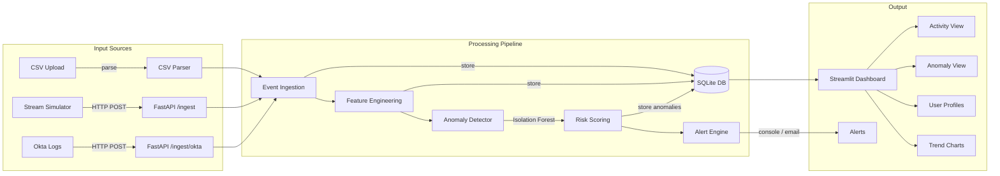
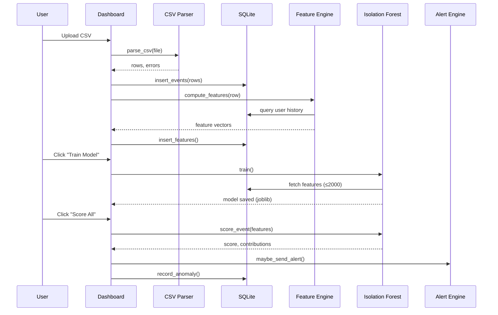

# Architecture

## System Overview

## Data Flow

## Components

| Component | Tech | Role |
|-----------|------|------|
| API | FastAPI + Uvicorn | REST endpoints for ingestion, scoring, queries |
| Dashboard | Streamlit | Web UI — upload, train, visualize |
| ML Engine | scikit-learn Isolation Forest | Unsupervised anomaly detection |
| Feature Engine | Python + SQLite queries | Temporal, geo, behavioral feature extraction |
| Storage | SQLite | Events, features, anomalies, alerts |
| Alerting | Console + SMTP | Risk-based notifications |
| Adapters | CSV parser, Okta normalizer | Multi-format log ingestion |

## ML Model

- **Algorithm:** Isolation Forest (unsupervised)
- **Contamination:** 5% (tunable)
- **Features (8):** hour, day_of_week, geo_distance_km, geo_velocity_kmh, failure_burst, resource_rarity, new_device, off_hours
- **Risk scoring:** Weighted sum of anomaly score + rule-based bonuses (off-hours, velocity, failures, rare resources, new devices)
- **Persistence:** joblib — train once, score repeatedly
