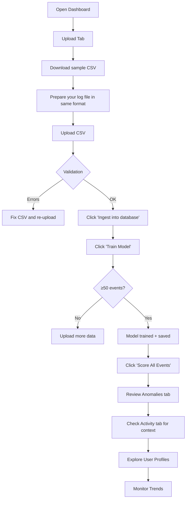

# Workflow

## Primary Flow: CSV Upload



## Step-by-Step

1. **Start services**
   - `uvicorn app.main:app --port 8000`
   - `streamlit run dashboard/app.py --server.port 8501`

2. **Upload data**
   - Dashboard → Upload tab
   - Download sample CSV as format reference
   - Upload your CSV (or the sample)
   - Click "Ingest into database"

3. **Train model**
   - Click "Train Model" (needs ≥50 events in DB)
   - Model is saved to `data/model.joblib`
   - Only needs to be done once per baseline dataset

4. **Score events**
   - Click "Score All Events"
   - Detector scores all stored features against the trained model
   - Anomalies + alerts stored in DB

5. **Review results**
   - **Anomalies tab** — flagged events with risk levels, reasons, feature contribution charts
   - **Activity tab** — all events, success/fail metrics, geo map
   - **Users tab** — per-user baseline profiles, typical hours/locations, failure rates
   - **Trends tab** — event volume over time, anomaly counts, resource usage

## Secondary Flow: Real-Time Stream

```bash
# Start stream simulator (events posted to /ingest endpoint)
python scripts/stream_simulator.py --rps 2 --anomaly-prob 0.1
```

- Events ingested, features computed, scored if model is trained
- Dashboard auto-refreshes on interaction

## Secondary Flow: API-Only

```bash
# Batch ingest via API
curl -X POST http://localhost:8000/upload/csv -F "file=@data/sample_logs.csv"

# Train
curl -X POST http://localhost:8000/train

# Score
curl -X POST http://localhost:8000/score

# View anomalies
curl http://localhost:8000/anomalies
```
