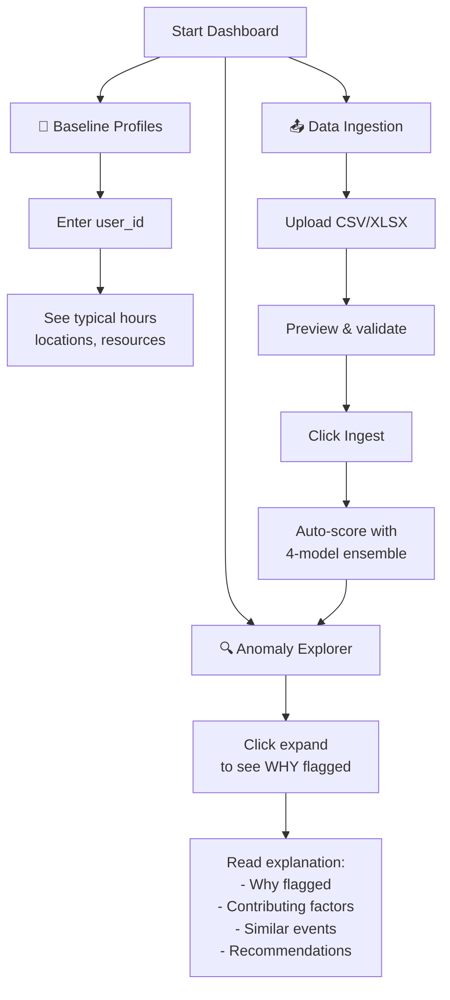

# Workflow

## Primary Flow: New Dashboard with 6 Tabs



## Step-by-Step Usage

### 1. Start Dashboard
```bash
cd /Users/abhijitkar/Documents/trae_projects/seminar/seminarr
source .venv/bin/activate
streamlit run dashboard/app.py --server.port 8501
```

Open: http://localhost:8501

### 2. Explore Pre-Trained Results (📊 Overview Tab)
- See 6 core requirements
- View model performance
- Navigate to specific tabs

### 3. View Anomalies & Explanations (🔍 Anomaly Explorer Tab) ⭐ MOST IMPORTANT
- Displays top 50 anomalies sorted by risk
- **Click expand arrow** on any anomaly to see:
  - **Event details** - ID, user, timestamp, scores
  - **Risk level** - 🟢🟡🟠🔴 with gauges
  - **❓ Why flagged?** - Specific reasons
  - **🔧 Contributing factors** - Feature importance ranked
  - **📚 Similar events** - User's historical context
  - **💡 Recommendations** - What to do (block? investigate?)

### 4. Check User Baseline (👤 Baseline Profiles Tab)
- Enter any `user_id` from your data
- See their typical behavior:
  - Login hours (chart)
  - Typical locations
  - Typical resources
  - Normal failure rate
- Understand what would be "unusual" for this user

### 5. Understand ML Performance (🧩 Ensemble Models Tab)
- See metrics: ROC-AUC (0.8884), F1, Recall, Accuracy
- View all 4 models:
  - Label Propagation
  - Label Spreading
  - Self-Training Random Forest
  - Self-Training Extra Trees
- See weight allocation

### 6. Upload New Data (📤 Data Ingestion Tab)
```
PROCESS:
1. See required columns
2. Download sample if needed
3. Upload CSV/XLSX
4. Preview parsed data
5. Click "💾 Ingest into System"
6. System:
   - Validates columns
   - Extracts 12 features
   - Scores with 4-model ensemble
   - Generates risk scores 0-100
   - Stores in database
7. Go to 🔍 Anomaly Explorer to see new anomalies
```

### 7. Review System Details (📈 Advanced Details Tab)
- Database statistics
- Features reference
- Configuration info

## Secondary Flow: Real-Time Stream (Optional)

```bash
# Start stream simulator
python scripts/stream_simulator.py --rps 2 --anomaly-prob 0.1
```

Events flow through system automatically:
- Ingested
- Features extracted
- Scored with ensemble
- Stored if anomalous
- Appear in Anomaly Explorer

## Secondary Flow: API-Only (Optional)

```bash
# Start API
uvicorn app.main:app --reload --port 8000

# Upload CSV
curl -X POST http://localhost:8000/ingest/csv -F "file=@data/sample.csv"

# Get anomalies
curl http://localhost:8000/anomalies

# Get user baseline
curl http://localhost:8000/baseline/user_123
```

## Key Workflows by Goal

### Goal: **See Pre-Trained Model Results**
1. Start dashboard
2. Go to 🧩 **Ensemble Models** tab
3. See ROC-AUC: 0.8884
4. Click "Score Dataset" to score Book1 data

### Goal: **Understand Why Event Was Flagged**
1. Go to 🔍 **Anomaly Explorer** tab
2. Find anomaly in list
3. Click expand arrow
4. Read "Why Was This Flagged?"
5. See "Contributing Factors"

### Goal: **Learn User's Normal Behavior**
1. Go to 👤 **Baseline Profiles** tab
2. Enter user_id (e.g., user_123)
3. See typical hours chart
4. See typical locations
5. See accessed resources

### Goal: **Upload and Score Company Logs**
1. Prepare CSV with: user_id, timestamp, resource, action, success
2. Go to 📤 **Data Ingestion** tab
3. Upload file
4. Click "💾 Ingest into System"
5. Go to 🔍 **Anomaly Explorer** → see detections

## Dashboard Tab Reference

```
TABS (LEFT TO RIGHT):
│
├─ 📊 Overview
│   └─ Quick reference to all 6 requirements
│
├─ 🔍 Anomaly Explorer ⭐ CORE
│   └─ Explanations: WHY flagged, contributing factors, recommendations
│
├─ 👤 Baseline Profiles
│   └─ User behavior patterns: typical hours, locations, resources
│
├─ 🧩 Ensemble Models
│   └─ ML performance: 4 models, metrics, scoring interface
│
├─ 📤 Data Ingestion
│   └─ Upload & process logs: validation, feature extraction, scoring
│
└─ 📈 Advanced Details
    └─ Database stats, features, configuration
```

## Risk Levels Explained

```
🟢 LOW (0-20)
   Unusual but likely benign
   Action: Monitor

🟡 MEDIUM (20-50)
   Notable deviation
   Action: Consider MFA

🟠 HIGH (50-75)
   Significant anomaly
   Action: Recommend blocking

🔴 CRITICAL (75-100)
   Multiple red flags
   Action: IMMEDIATE INVESTIGATION
```
